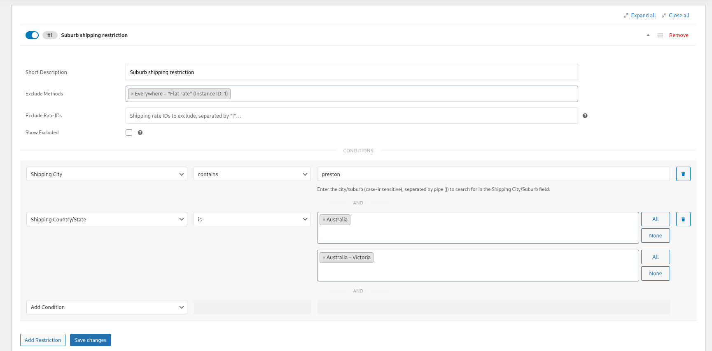
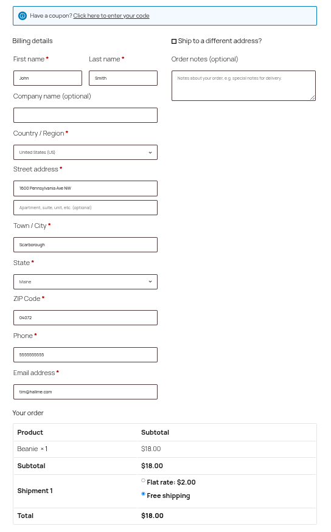
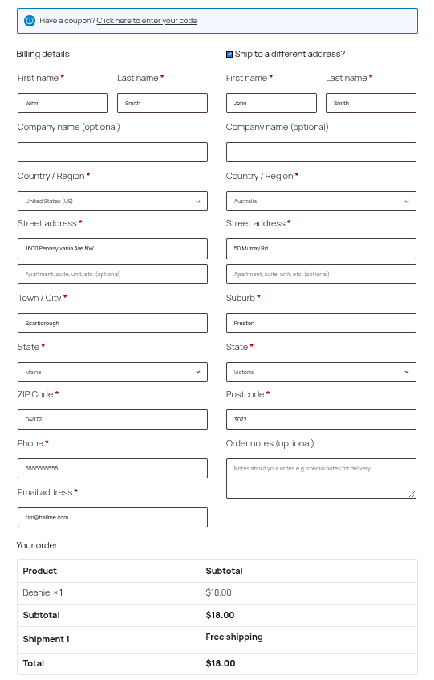

# WooCommerce Conditional Shipping and Payments - City Extension

This plugin is to extends the [WooCommerce Conditional Shipping and Payments](https://woocommerce.com/products/conditional-shipping-and-payments/) plugin to allow conditional logic to be applied to the shipping and/or billing city fields to check if the do or do not contain specified strings.

This plugin was created with the intention of being an example/demo of how it would work and be added to the core plugin itself.

### Requirements
 - PHP 7.4+
 - WordPress 6.2+
 - WooCommerce 8.2+.
 - WooCommerce Conditional Shipping and Payments 2.0+

 ### Installation
 1. Download the plugin release files.
 1. Add plugin.zip file to your site's plugin directory via FTP or [Uploading the Plugin](https://wordpress.org/documentation/article/plugins-add-new-screen/#upload-plugins).
 1. Activate the plugin.

 ### Getting Started
 To use the new feature simple follow the same steps you would to add a [global or product based restriction](https://woocommerce.com/document/woocommerce-conditional-shipping-and-payments/#creating-restrictions).

 #### Example
 This is an example of how the plugin can be used to set a global restriction on a shipping method from being selected if a certain city or suburb is entered.

 1. After logging in go to WooCommerce > Settings then the Restrictions tab.
 1. Under the Shipping Methods click the 'Add Restriction' button.
 1. Set the 'Short Description' explaining the restriction. In this example we would describe it as "Suburb shipping restriction"
 1. Set the 'Exclude Methods' to the shipping methods you would like excluded when the conditions are met.
 1. Set the Add Condition dropdown to 'Shipping City'
 1. Set the condition to "contains" to search for our key word strings used in the shipping city/suburb checkout fields.
 1. Enter a list of keywords as a case insensitive string separated by pipe "|" that would meet the condition and trigger the restriction. In this case it would be a string of all the variations used to denote a suburb you wish to exclude.
    - Example: ```preston```
1. Set another condition in the Add Condition dropdown to 'Shipping Country/State'
1. Set the condition to "is" to search for our key word strings used in the shipping Country/State checkout fields.
1. Select the country as Australia and state/county to Australia - Victoria.
1. Save the restriction.

This example will look at the shipping city/suburb and if any of the variation someone might use when filling out a shipping form to denote the Australian suburb of Preston, Victoria strings are using for the shipping city/suburb, or billing address if used as shipping, it will exclude the shipping methods mentioned in the restriction.

This example can be repeated for other restrictions as well. 





